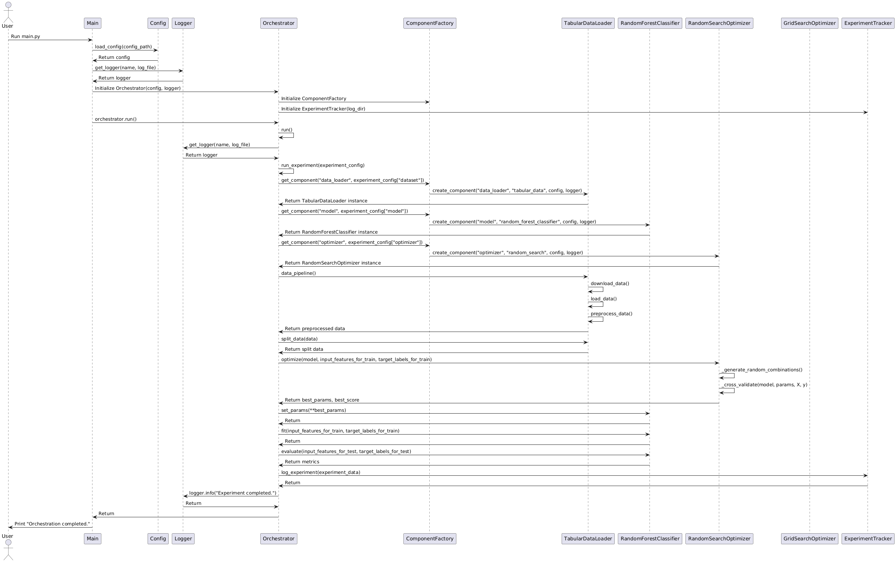
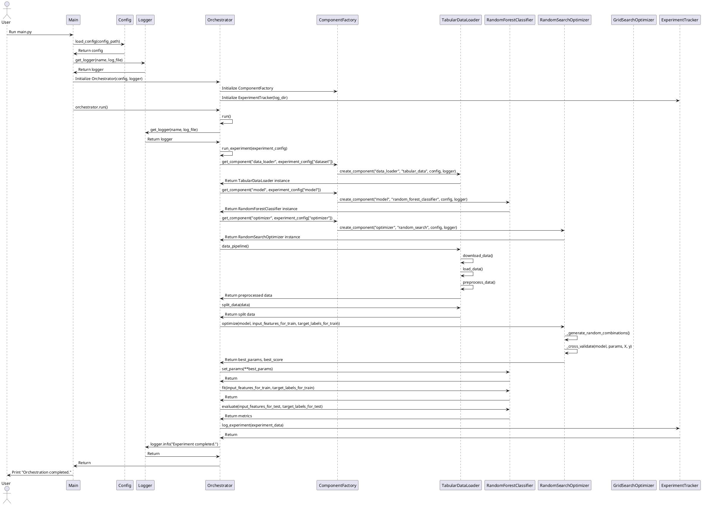
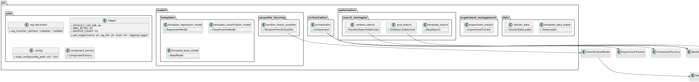
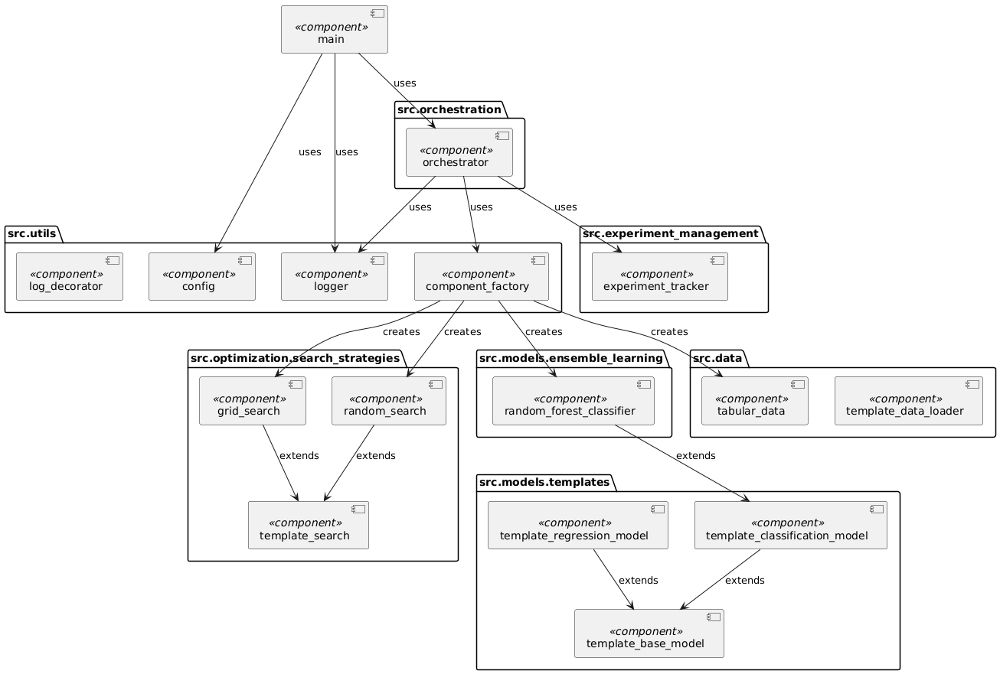
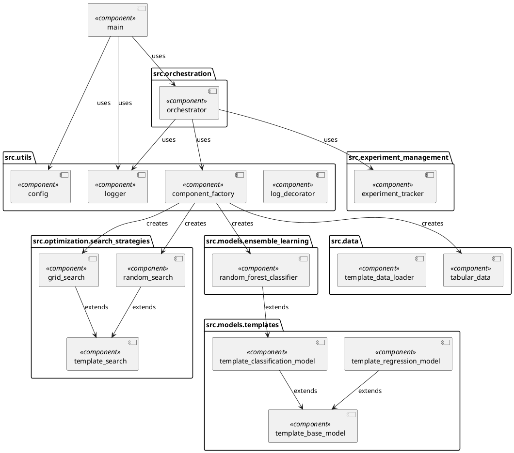

# Hyperparameter Testing Framework Architecture

## 1. Core Framework Architecture

### A. Modular Design

- **Data Module**: 
  - Handles dataset loading, preprocessing, and splitting.
  - Ensures proper preparation of datasets, including handling missing data, normalization, and encoding of categorical features.

- **Model Module**: 
  - Encapsulates machine learning algorithms.
  - Provides an interface to define, train, and evaluate models with different hyperparameters.

- **Optimization Module**: 
  - Contains various hyperparameter optimization strategies (e.g., Grid Search, Random Search, Bayesian Optimization).
  - Manages the search space and the exploration strategies.

- **Metrics Module**: 
  - Defines performance metrics and supports custom metrics.
  - Handles evaluation of model performance based on chosen metrics.

- **Evaluation Module**: 
  - Compares different optimization algorithms.
  - Aggregates results across multiple datasets, models, and hyperparameters.

- **Experiment Management Module**: 
  - Logs experiments, tracks hyperparameters, records results, and ensures reproducibility.
  - Integrates with tools like MLflow or Optuna's study tracking.

- **Orchestration Module**: 
  - High-level controller that orchestrates the execution of different experiments.
  - Manages the workflow from dataset selection to model evaluation.

### B. Scalability Considerations

- **Distributed Computing**: 
  - Enables parallel execution of hyperparameter optimization processes across multiple nodes or GPUs.
  - Essential for handling large datasets and computationally expensive models.

- **Pipeline Integration**: 
  - Provides hooks for integration with MLOps pipelines for continuous training and deployment.

## 2. Workflow for Hyperparameter Testing

### Step 1: Dataset Preparation
- **Data Module** loads datasets in different variations (small, medium, large).
- Datasets are preprocessed based on type (e.g., time-series, image, text).
- Define dataset sizes:
  - **Small**: <1,000 records.
  - **Medium**: 1,000-100,000 records.
  - **Large**: >100,000 records.

### Step 2: Model Definition
- **Model Module** initializes machine learning models (e.g., SVM, Random Forest, Neural Networks) with configurable hyperparameters.
- Hyperparameters are defined with ranges or distributions for exploration.

### Step 3: Optimization Execution
- **Orchestration Module** triggers optimization runs using strategies in the **Optimization Module**.
- For each run, the **Optimization Module** selects hyperparameters, trains the model via the **Model Module**, and evaluates using the **Metrics Module**.

### Step 4: Evaluation
- **Evaluation Module** aggregates results from optimization runs.
- Compares based on metrics like accuracy, AUC-ROC, log loss, and computational factors (time, memory usage).
- Evaluates robustness against overfitting and underfitting.

### Step 5: Result Logging and Analysis
- **Experiment Management Module** logs all experiments.
  - Captures hyperparameters, model configurations, datasets, metrics, and resource usage.
- Generates detailed reports showing the performance of different optimization algorithms across various scenarios.

## 3. Tools and Technologies

- **Programming Language**: Python.
- **Libraries**:
  - **TensorFlow**: For model training and evaluation.
  - **Logging**: For logging experiment details.
  - **argparse**: For command-line argument parsing.
  - **functools**: For higher-order functions and decorators.
  - **abc**: For defining abstract base classes.
  - **typing**: For type hints and type checking.
  - **json**: For configuration file handling.
  - **pathlib**: For filesystem path manipulation.

## 4. Diagrams

### Sequence Diagram

### Class Diagram

```plantuml
@startuml
package "src.utils" {
    class log_decorator {
        + log_function_call(func: Callable) : Callable
    }

    class logger {
        - DEFAULT_LOG_DIR: str
        - MAX_BYTES: int
        - BACKUP_COUNT: int
        + get_logger(name: str, log_file: str, level: int) : logging.Logger
    }

    class config {
        + load_config(config_path: str) : dict
    }

    class component_factory {
        + ComponentFactory
    }
}

package "src.orchestration" {
    class orchestrator {
        + Orchestrator
    }
}

package "src.optimization.search_strategies" {
    class random_search {
        + RandomSearchOptimizer
    }

    class grid_search {
        + GridSearchOptimizer
    }

    class template_search {
        + BaseSearch
    }
}

package "src.models.ensemble_learning" {
    class random_forest_classifier {
        + RandomForestClassifier
    }
}

package "src.models.templates" {
    class template_regression_model {
        + RegressionModel
    }

    class template_classification_model {
        + ClassificationModel
    }

    class template_base_model {
        + BaseModel
    }
}

package "src.experiment_management" {
    class experiment_tracker {
        + ExperimentTracker
    }
}

package "src.data" {
    class tabular_data {
        + TabularDataLoader
    }

    class template_data_loader {
        + DataLoader
    }
}

package "main" {
    class main {
        + main()
    }
}

random_search --> BaseSearch
grid_search --> BaseSearch
random_forest_classifier --> ClassificationModel
ClassificationModel --> BaseModel
RegressionModel --> BaseModel
orchestrator --> ComponentFactory
orchestrator --> ExperimentTracker
orchestrator --> get_logger
main --> load_config
main --> get_logger
main --> Orchestrator
@enduml
```

### Component Diagram

