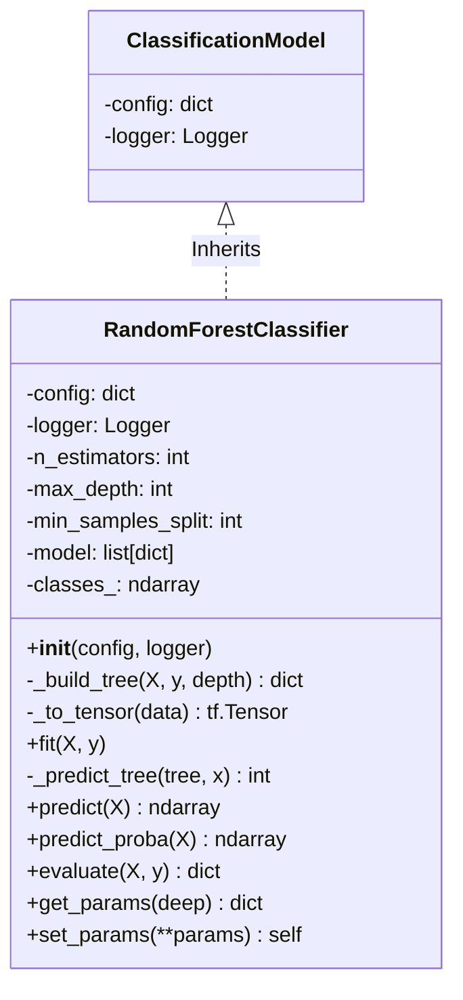
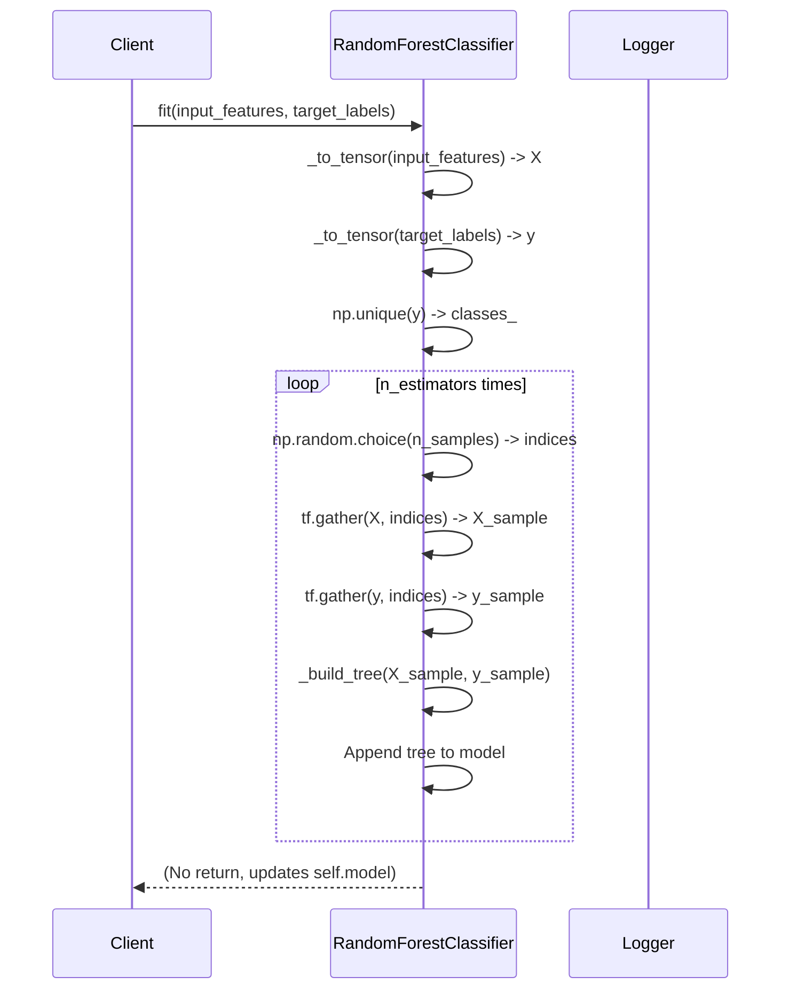
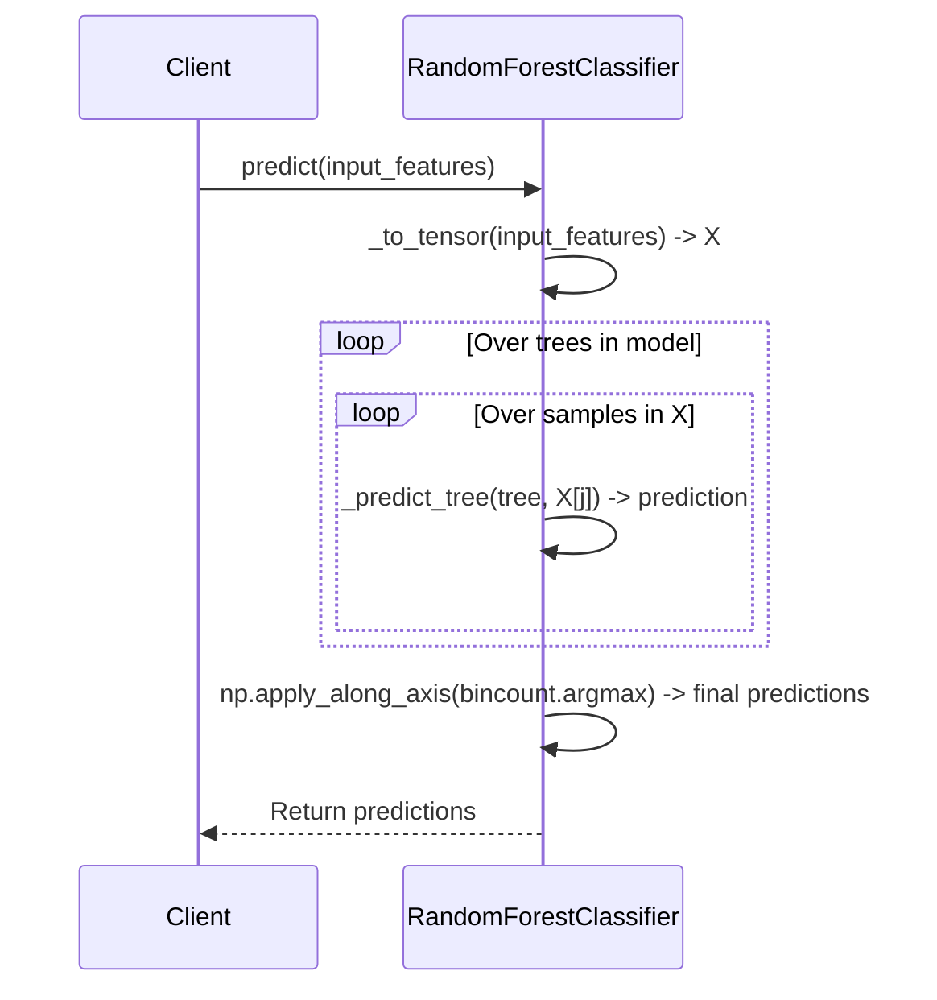
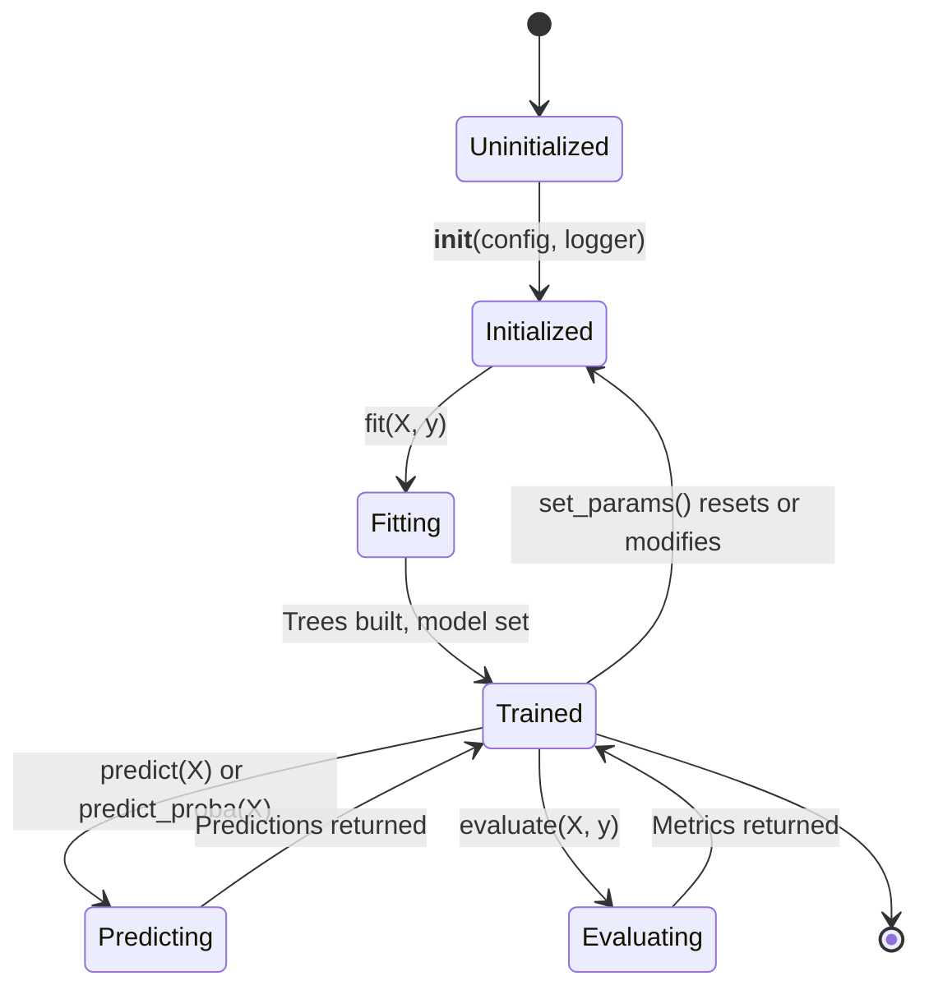
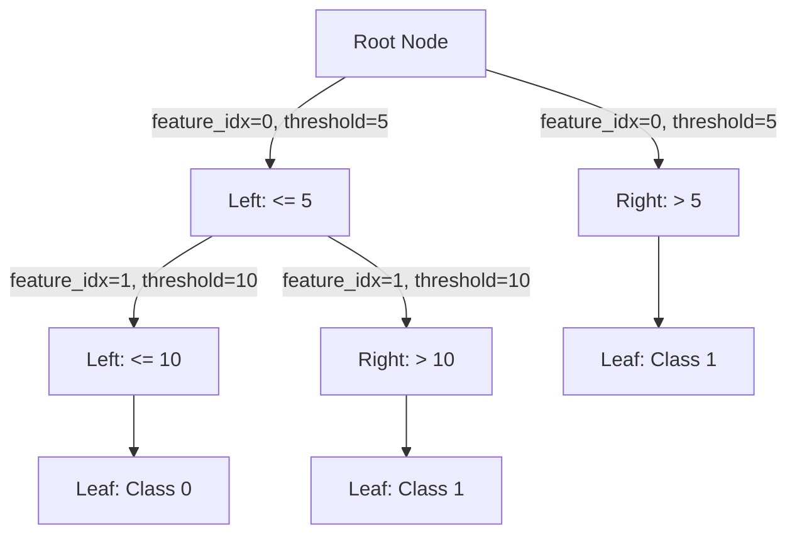

```mermaid
graph TD
    A[Client] -->|input_features, target_labels| B[RandomForestClassifier]
    B -->|X, y| B : _to_tensor()
    B -->|X_sample, y_sample| B : fit() builds trees
    B -->|input_features| B : predict() or predict_proba()
    B -->|predictions| A
    B -->|input_features, target_labels| B : evaluate()
    B -->|metrics| A
```