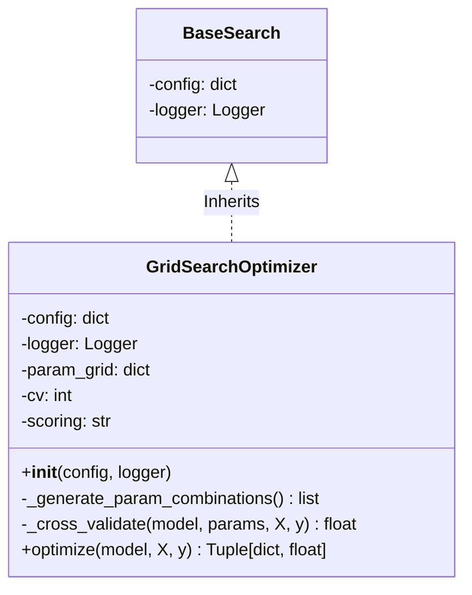
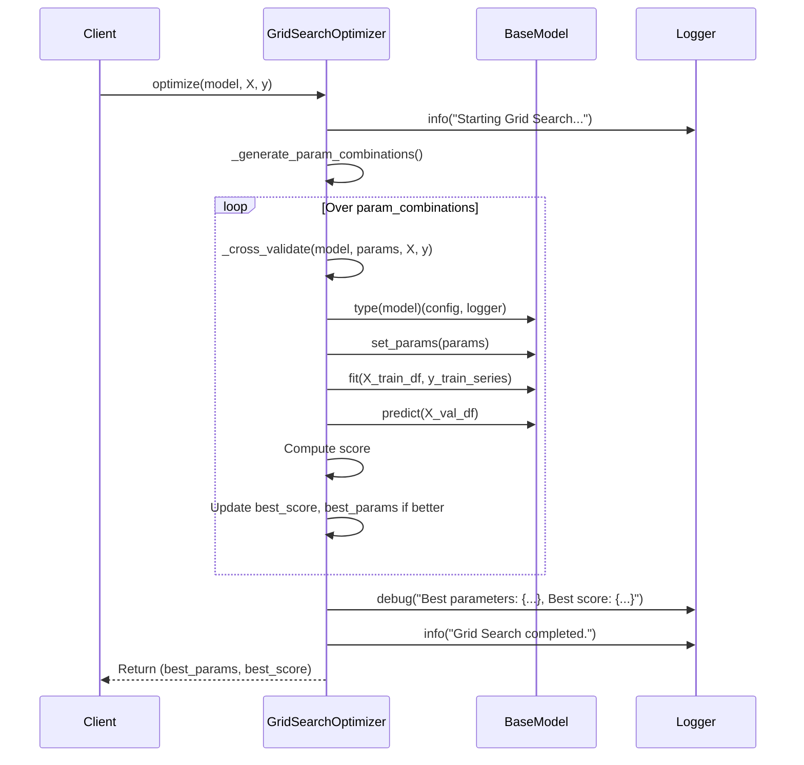
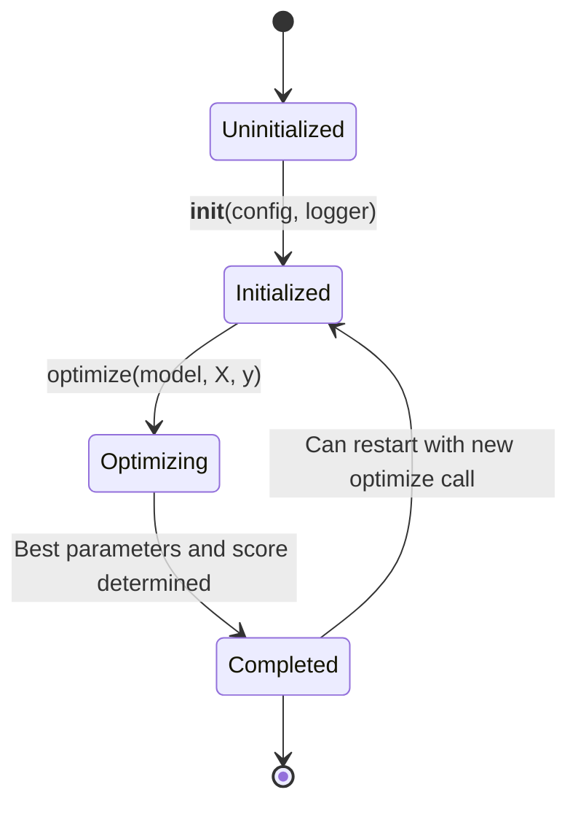
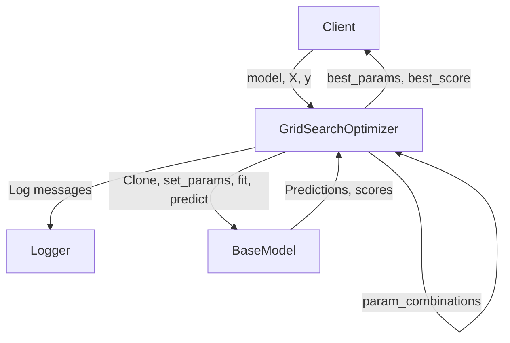

```mermaid
graph TD
    A[Start Grid Search] --> B[Combo 1: {param1: v1, param2: w1}]
    A --> C[Combo 2: {param1: v1, param2: w2}]
    A --> D[Combo N: {param1: vN, param2: wM}]
    B --> B1[Fold 1 Score]
    B --> B2[Fold 2 Score]
    B --> B3[...]
    C --> C1[Fold 1 Score]
    C --> C2[Fold 2 Score]
    C --> C3[...]
    D --> D1[Fold 1 Score]
    D --> D2[Fold 2 Score]
    D --> D3[...]
```
