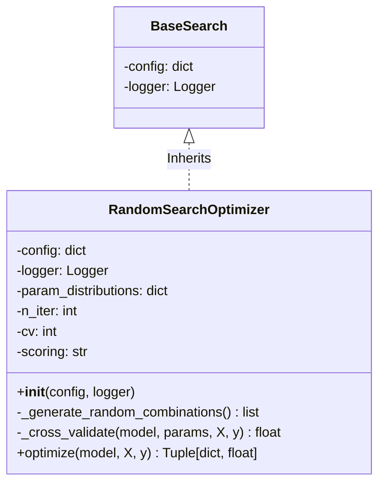
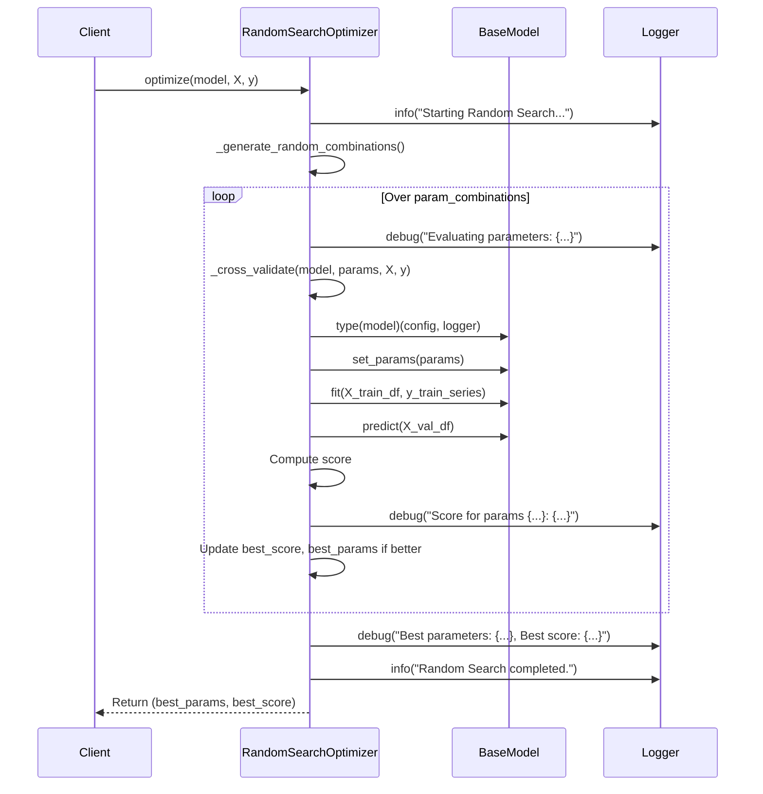
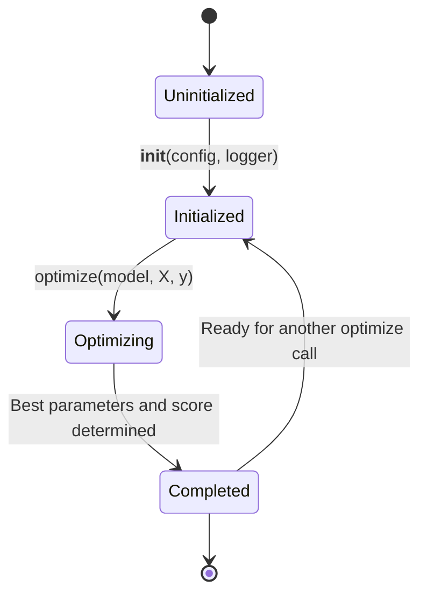
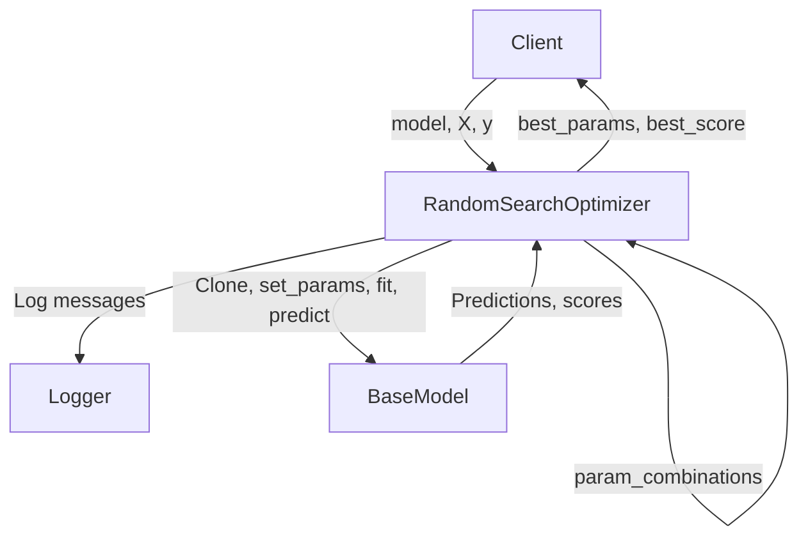

```mermaid
graph TD
    A[Start Random Search] --> B[Sample 1: {param1: v_rand1, param2: w_rand1}]
    A --> C[Sample 2: {param1: v_rand2, param2: w_rand2}]
    A --> D[Sample N: {param1: v_randN, param2: w_randM}]
    B --> B1[Fold 1 Score]
    B --> B2[Fold 2 Score]
    B --> B3[...]
    C --> C1[Fold 1 Score]
    C --> C2[Fold 2 Score]
    C --> C3[...]
    D --> D1[Fold 1 Score]
    D --> D2[Fold 2 Score]
    D --> D3[...]
```
